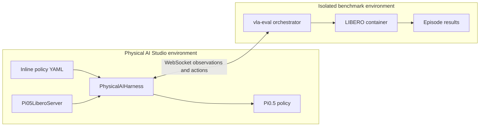
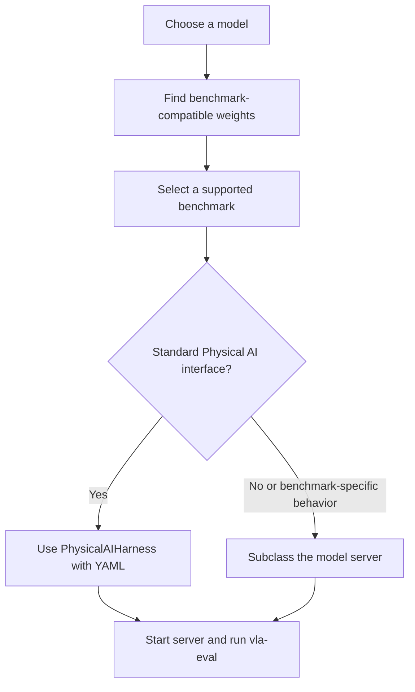

# VLA Evaluation Harness Integration

## Purpose

Physical AI Studio uses external evaluation harnesses to reproduce published
policy results without adding simulator dependencies to the core package. The
first integration targets AllenAI's
[`vla-evaluation-harness`](https://github.com/allenai/vla-evaluation-harness)
and uses Pi0.5 on LIBERO as the reference implementation.

The integration lives in `benchmarks/vla-evaluation-harness/`, outside the
`physicalai` package. External harnesses can change independently, and their
simulators often require conflicting Python, system, or GPU dependencies.
Keeping the adapter separate preserves a small package surface while still
providing reproducible examples.

## Design Decisions

- Install `vla-eval` from its published package; do not vendor it or maintain a
  git submodule.
- Keep the model-server and benchmark run YAMLs needed by our examples under
  `benchmarks/vla-evaluation-harness/configs/`.
- Run the model server in the Physical AI Studio environment so it can load the
  policy and its dependencies.
- Let `vla-eval` run the benchmark environment, normally in Docker.
- Communicate between the two processes through the model server protocol.
- Support a general YAML-driven server and benchmark-specific Python servers.
- Keep benchmark observation mapping, action chunking, and checkpoint defaults
  visible in the adapter or its config.

## Architecture



The model server owns policy construction and conversion between the harness
observation format and `physicalai.data.Observation`. The orchestrator owns
task selection, episodes, simulator lifecycle, recording, and result
aggregation.

## User Workflow

1. **Choose a model.** Select the policy implementation to evaluate, such as
   Pi0.5.
2. **Find compatible weights.** Identify which benchmark the available weights
   were trained or fine-tuned for. For example,
   `lerobot/pi05_libero_finetuned_v044` targets LIBERO.
3. **Select the benchmark.** Confirm that the external harness supports that
   benchmark and locate its run config, such as LIBERO-10.
4. **Choose an adapter.** Use the general config-driven server when the policy
   fits the standard Physical AI interface. Add a Python subclass when custom
   preprocessing, protocol behavior, or stable benchmark-specific defaults are
   required.



## Installation

Install the Physical AI Studio policy dependencies and `vla-eval` in the
environment used to launch the model server:

```bash
cd library
uv sync --extra cu128 --extra pi05
uv pip install vla-eval
```

Use the backend extra appropriate for the machine, such as `cpu`, `cu128`, or
`xpu`. Docker is required when the selected `vla-eval` benchmark runs its
simulator in a container.

## Configuration Ownership

The installed `vla-eval` distribution supplies the CLI, model-server protocol,
and benchmark implementations. Its package data does not provide a stable path
to the upstream repository's example YAML files. A normal
`uv pip install vla-eval` must therefore not be expected to create a local
`configs/` directory.

Physical AI Studio owns the complete set of YAML files referenced by this
integration. This keeps each example reproducible against the installed
`vla-eval` version and avoids depending on files outside the Python package:

```text
benchmarks/vla-evaluation-harness/
├── configs/
│   ├── pi05_libero_policy.yaml
│   └── benchmarks/
│       └── libero/
│           ├── smoke_test.yaml
│           └── 10.yaml
└── model_servers/
    ├── physicalai_harness.py
    └── pi05_libero.py
```

There are two distinct config types:

- **Model-server config:** Constructs the Physical AI policy and defines its
  observation mapping, device, action chunking, and server port. For example,
  `configs/pi05_libero_policy.yaml`.
- **Benchmark run config:** Selects the `vla-eval` benchmark implementation,
  suite, tasks, episode count, recording, and output location. For example,
  `configs/benchmarks/libero/10.yaml`.

The active `.venv` can identify where `vla_eval` was imported from, but it is
not a reliable source for these configs. In particular, an editable install
may resolve imports to a nearby source checkout whose repository-level
`configs/` directory happens to be present. Those YAML files are outside the
installed `vla_eval` Python package and will not necessarily exist after a
regular package installation.

## Option 1: General Config-Driven Server

`PhysicalAIHarness` loads any supported `Policy` or exported `InferenceModel`
from a `class_path` and `init_args` declaration. The policy is defined directly
in the server YAML so one file describes the complete model-server setup.

Pi0.5 with LIBERO:

```yaml
args:
  policy:
    class_path: physicalai.policies.pi05.Pi05
    init_args:
      pretrained_name_or_path: lerobot/pi05_libero_finetuned_v044
  image_keys:
    agentview: image
    wrist: image2
  state_key: observation.state
  chunk_size: 10
  device: cuda
  port: 8000
```

Start the generic server:

```bash
cd library/benchmarks/vla-evaluation-harness
python model_servers/physicalai_harness.py \
  --config configs/pi05_libero_policy.yaml
```

This path is preferred when configuration alone can express policy loading,
camera mapping, state mapping, device placement, and action chunking.

## Option 2: Benchmark-Specific Python Server

A dedicated server is useful when a model-benchmark pair needs custom
preprocessing or is run often enough to justify stable defaults. The subclass
constructs the policy and delegates the shared prediction and protocol logic to
`PhysicalAIHarness`.

```python
from typing import Any

from physicalai.policies.pi05 import Pi05
from vla_eval.model_servers.serve import run_server

from physicalai_harness import PhysicalAIHarness


class Pi05LiberoServer(PhysicalAIHarness):
    def __init__(
        self,
        pretrained_name_or_path: str = "lerobot/pi05_libero_finetuned_v044",
        device: str = "cuda",
        **kwargs: Any,
    ) -> None:
        policy = Pi05(pretrained_name_or_path=pretrained_name_or_path)
        super().__init__(
            _policy=policy,
            image_keys={"agentview": "image", "wrist": "image2"},
            state_key="observation.state",
            chunk_size=10,
            device=device,
            **kwargs,
        )


if __name__ == "__main__":
  run_server(Pi05LiberoServer)
```

Start it without a model-server config:

```bash
cd library/benchmarks/vla-evaluation-harness
python model_servers/pi05_libero.py --port 8000
```

The subclass should only own construction and benchmark-specific behavior.
Observation conversion, prediction, action specs, and episode reset behavior
remain in the general harness unless the protocol itself differs.

## Running the Benchmark

The model server and benchmark orchestrator are separate long-running
processes. After starting either server option in the first terminal, run the
benchmark in a second terminal:

```bash
cd library/benchmarks/vla-evaluation-harness
uv run vla-eval run --config configs/benchmarks/libero/10.yaml
```

The referenced benchmark config is maintained with this adapter. Installing
`vla-eval` supplies the orchestrator and benchmark implementations, not this
repository's chosen model and run configuration.

Start with a smoke test before a full evaluation. A successful smoke test
checks the server connection, camera and state mapping, action dimensions, and
chunking without spending the compute required for the full suite.
