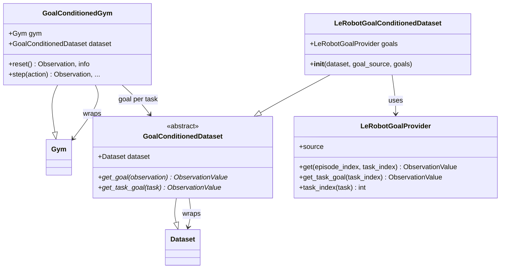

# Goal Conditioning

A goal-conditioned policy gets a goal with every observation. The goal shows the
state the policy should reach.

This matters for multi-task benchmarks like LIBERO-goal. All tasks start from the
same scene. Without a goal, the policy cannot tell which task to do.

The goal is the **last frame of a demonstration**. It is added in training and
in rollouts, so the policy always sees the same fields.

## Observation Field

| Field         | Constant      | Content                                     |
| ------------- | ------------- | ------------------------------------------- |
| `goal_images` | `GOAL_IMAGES` | Goal images, in the same layout as `images` |

It is `None` when goals are off.

## Architecture



- `GoalConditionedDataset` adds a goal to each training sample.
- `LeRobotGoalConditionedDataset` does this for LeRobot datasets.
- `GoalConditionedGym` adds a goal to each rollout observation.

## Training

`goal_source` picks which last frame is the goal:

| `goal_source`   | Goal                                                 |
| --------------- | ---------------------------------------------------- |
| `"task"`        | The task's first episode. Same as Patch Policy.      |
| `"episode"`     | The sample's own episode.                            |
| `"task_sample"` | A random episode of the same task, drawn per sample. |

```python test="skip" reason="requires physicalai install and downloads data"
from lerobot.datasets.lerobot_dataset import LeRobotDataset

from physicalai.data.lerobot import LeRobotDataModule, LeRobotGoalConditionedDataset

# Let the datamodule add goals
datamodule = LeRobotDataModule(repo_id="lerobot/libero", goal_source="task")

# Or wrap the dataset yourself
dataset = LeRobotGoalConditionedDataset(LeRobotDataset("lerobot/libero"), goal_source="task")
datamodule = LeRobotDataModule(dataset=dataset)
```

Goals need `data_format="physicalai"`.

## Rollouts

`GoalConditionedGym` adds the goal for the gym's current task:

```python test="skip" reason="requires LIBERO and downloads data"
from lerobot.datasets.lerobot_dataset import LeRobotDataset

from physicalai.data.lerobot import LeRobotGoalConditionedDataset
from physicalai.gyms import GoalConditionedGym, LiberoGym

dataset = LeRobotGoalConditionedDataset(LeRobotDataset("lerobot/libero"), goal_source="task")
gym = GoalConditionedGym(LiberoGym(task_suite="libero_goal", task_id=3), dataset)

obs, _ = gym.reset(seed=0)
obs.goal_images["image"].shape  # torch.Size([1, 3, 256, 256])
```

- On each reset, the gym's task text is matched to a dataset task.
- The gym always uses that task's `"task"` goal.
- The goal matches the gym's batch size and camera names.
- Use `camera_map` if camera names differ.

## Caveats

- **The last frame must show the finished task.** This is true for PushT and
  LIBERO. It is not true for
  [cyclic recordings](../../how-to/data/recording-a-dataset.md#the-single-most-important-rule-record-cyclic-episodes),
  where the arm returns home. Crop those episodes to end when the task is done.
- **Gyms must report their task** in `Observation.task`. The text must match a
  dataset task.
- **Policies must normalise goals.** Use the same statistics as `images`.
- **Check your goals.** Save a few `goal_images` and look at them before
  training.

## See Also

- [LeRobot Data Integration](lerobot.md)
- [Observation](observation.md)
- [GoalConditionedGym](../gyms/goal.md)
