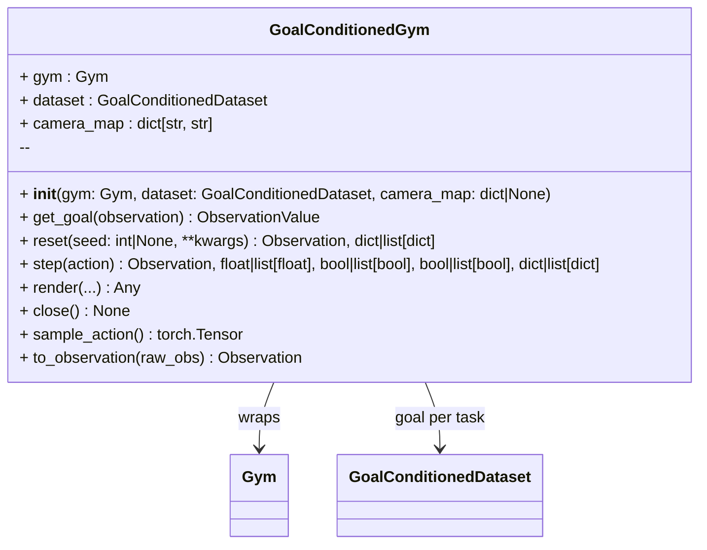

# GoalConditionedGym

A wrapper that attaches the goal for the gym's current task to every observation.

On every `reset()` the gym's task description (`Observation.task`) is looked up in a
goal-conditioned dataset, and that task's fixed goal is attached to every observation
from `reset()` and `step()`, batched and laid out like the gym's own images. Everything
else is forwarded to the wrapped gym.



Example:

```python test="skip" reason="requires LIBERO and downloads data"
from lerobot.datasets.lerobot_dataset import LeRobotDataset

from physicalai.data.lerobot import LeRobotGoalConditionedDataset
from physicalai.gyms import GoalConditionedGym, LiberoGym

dataset = LeRobotGoalConditionedDataset(LeRobotDataset("lerobot/libero"), goal_source="task")
gym = GoalConditionedGym(LiberoGym(task_suite="libero_goal", task_id=3), dataset)

obs, _ = gym.reset(seed=0)
obs.goal_images["image"].shape  # torch.Size([1, 3, 256, 256])
```

See [Goal Conditioning](../data/goal-conditioning.md) for how goals are chosen, task
matching and camera layout.
