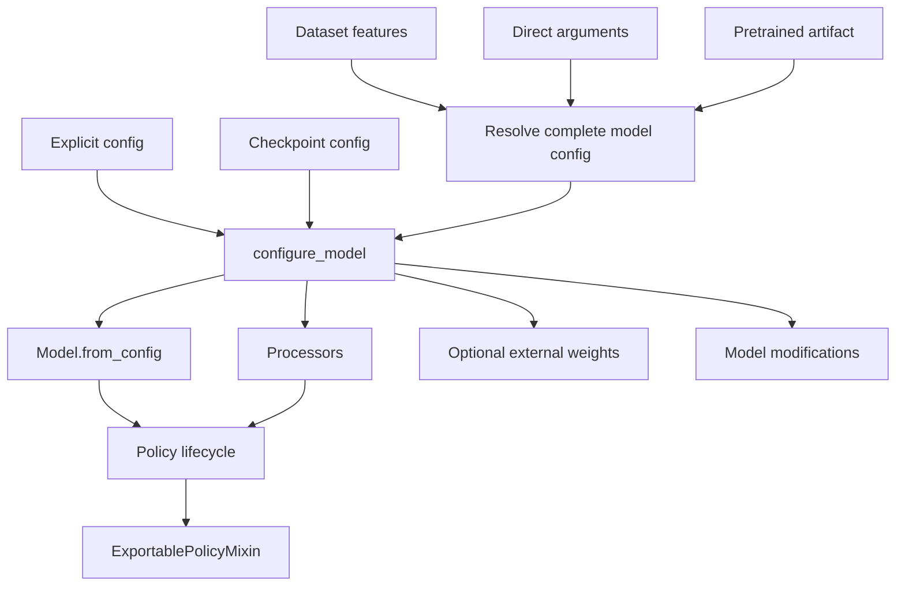

# Policy Design

Policies are Lightning modules that wrap PyTorch models for training, validation,
inference, checkpointing, and export. This document describes the design for native
PhysicalAI policies.

The central construction rule is:

> Every route that creates a model resolves a complete model config and passes it
> through one policy-owned materialization method.

The examples use `MyPolicy`, `MyModel`, and `MyModelConfig`. A concrete policy may
have different model components and processors, but should preserve the lifecycle and
ownership boundaries described here.

## Structure

A native policy normally separates configuration, model computation, processing, and
Lightning integration:

```text
policy_name/
|-- config.py        # Serializable model configuration
|-- model.py         # PyTorch model
|-- policy.py        # Lightning lifecycle and construction routes
|-- preprocessor.py  # Observation conversion and normalization
`-- postprocessor.py # Action conversion and denormalization
```

Small policies may combine these files. The separation of responsibilities matters
more than the file layout.



## Base Contracts

### Model

`Model` is the PyTorch computation boundary. It receives preprocessed tensors and
owns network computation, training loss, validation loss, and temporal indices.

```python
class MyModel(TemplateModel):
    def forward(
        self,
        batch: dict[str, Tensor],
    ) -> Tensor | tuple[Tensor, dict[str, Tensor | float]]:
        if self.training:
            return self.compute_loss(batch)
        return self.predict_action_chunk(batch)

    def compute_loss(
        self,
        batch: dict[str, Tensor],
    ) -> tuple[Tensor, dict[str, Tensor | float]]:
        ...

    @torch.no_grad()
    def compute_val_loss(
        self,
        batch: dict[str, Tensor],
    ) -> tuple[Tensor, dict[str, Tensor | float]]:
        ...

    @torch.no_grad()
    def predict_action_chunk(self, batch: dict[str, Tensor]) -> Tensor:
        ...
```

`compute_loss()` returns a loss tensor with gradients and a metrics dictionary with
at least a `"loss"` key. `compute_val_loss()` may reuse the training loss.

`predict_action_chunk()` must return the model's complete native action tensor with
shape `(batch_size, chunk_size, model_action_dim)`. It must not truncate the temporal
axis to `n_action_steps` or trim padded action dimensions. Mixins such as real-time
chunking need the full model chunk to revise, blend, or otherwise transform future
actions before the external action contract is applied.

Chunk and dimension adaptation belong outside the model:

- the policy/postprocessor converts `model_action_dim` to the environment action
    dimension, including unpadding or feature-based slicing;
- runtime postprocessing trims the chunk to `n_action_steps` before the base action
    queue consumes it;
- exported pipelines add an `action_chunk_trimmer` when `n_action_steps != chunk_size`.

This keeps `chunk_size` as the model prediction horizon and `n_action_steps` as the
policy execution horizon. A model that returns only `n_action_steps` discards context
before policy mixins can use it.

The model also implements `observation_delta_indices`, `action_delta_indices`, and
`reward_delta_indices`. Data loading uses these properties to select the temporal
context required by the model.

### Policy

`Policy` is the Lightning and environment-facing boundary. It receives
`Observation` objects and owns:

- model and processor lifecycle;
- training and validation integration;
- optimizer construction;
- checkpoint config persistence;
- pretrained artifact resolution and weight loading;
- action queue management inherited from the base class;
- optional export integration through `ExportablePolicyMixin`.

`TemplatePolicy` implements the common `forward()`, `predict_action_chunk()`,
`compute_val_loss()`, and `training_step()` flow, along with Lightning checkpoint
serialization and restoration. A concrete native policy supplies config-driven
initialization, processors, model, and `configure_optimizers()`.

The base `Policy.select_action()` calls `predict_action_chunk()` when its action queue
is empty, queues up to `n_action_steps`, and returns one action at a time. `reset()`
clears that queue at the start of an episode. The resolved model action horizon and
the value passed to `Policy.__init__()` must therefore agree.

The base class also:

- transfers `Observation` batches to the active Lightning device;
- dispatches observation validation to `compute_val_loss()`;
- runs validation and test rollouts for gym batches;
- aggregates rollout metrics across an epoch.

## Model Configuration

The model config is a serializable description owned by the policy, not the model.
Features are ordered lists because order affects model inputs, action concatenation,
postprocessing, and exported manifests.

```python
@dataclass
class MyModelConfig(Config):
    input_features: list[Feature]
    output_features: list[Feature]
    action_dim: int
    hidden_size: int = 1024
    chunk_size: int = 32
    n_action_steps: int = 32
```

`MyModel` never stores or exposes this config. Its constructor takes only the flat,
plain-typed arguments it actually needs — no `Feature` objects, no `list[...]` of
feature metadata — so the model stays fully described by its own signature and
remains straightforward to instantiate from a config, CLI, or jsonargparse-style
tooling:

```python
class MyModel(TemplateModel):
    def __init__(
        self,
        *,
        hidden_size: int = 1024,
        chunk_size: int = 32,
        action_dim: int = 32,
    ) -> None:
        super().__init__()
        self._chunk_size = chunk_size
        ...

```

`TemplateModel` inherits `jsonargparse.FromConfigMixin` and makes its construction
non-strict: `from_config()` accepts a dataclass or mapping, keeps only fields declared
by the concrete model constructor, and delegates those values to jsonargparse. The
policy can therefore pass its complete config directly; policy-only fields such as
`input_features`, `output_features`, and `n_action_steps` never reach the model.

Normalization parameters are optional data on each `Feature`. They do not define the
feature contract. A feature still has a name, type, shape, and position when no
normalization statistics are available.

## Ownership

| Owner | Responsibilities |
| --- | --- |
| Model config | Ordered features, architecture, chunk size, action horizon, and serializable model behavior — held and serialized by the policy |
| Policy | Training lifecycle, optimizer settings, export settings, artifact selection, external weight loading, and model modifications |
| Dataset | Training feature contract, feature order, and optional normalization statistics |
| Model | Network construction, loss computation, temporal indices, and action prediction — constructed from plain scalar arguments, never from the config object itself |
| Processors | Conversion and normalization before and after the model |
| Pretrained resolver | Artifact lookup and translation of artifact metadata into a model config plus weight paths |
| Capability mixins | Cross-cutting config, policy lifecycle, and model behavior for optional capabilities |

Optimizer settings, training lifecycle controls, and artifact locations are not model
configuration. Conversely, feature-dependent architecture and output interpretation
must not be inferred indirectly from optimizer settings or `dataset_stats`.

## Capability Mixins

Capabilities that cross config, policy, and model boundaries use the existing mixin
families rather than policy-specific flags:

```python
@dataclass(frozen=True, kw_only=True)
class MyModelConfig(PeftConfigMixin, Config):
    ...

class MyModel(PeftModelMixin, RTCModelMixin, TemplateModel):
    @classmethod
    def get_default_peft_targets(cls) -> tuple[str, ...]:
        return ("action_head",)

class MyPolicy(
    PeftPolicyMixin,
    RTCPolicyMixin,
    ExportablePolicyMixin,
    TemplatePolicy,
):
    ...
```

The order during model construction is significant:

1. Construct the base model.
2. Load pretrained base-model weights, when present.
3. Call `PeftPolicyMixin._inject_lora()` when `config.use_lora` is enabled.
4. Call `RTCPolicyMixin._sync_rtc_to_model()` after the model exists.

PEFT is reconstruction state because adapter injection changes state-dict keys.
`PeftConfigMixin` therefore stores the LoRA settings in the checkpointed model config,
and reconstruction injects adapters before Lightning restores checkpoint tensors. The
model owns architecture-specific default targets through
`PeftModelMixin.get_default_peft_targets()`.

RTC is runtime state rather than model architecture. `RTCPolicyMixin` owns and
checkpoints the enabled flag, while `RTCModelMixin` supplies model-side RTC behavior.
The policy synchronizes the flag after model construction. RTC operates on the full
native action chunk, before policy postprocessing trims it to the execution horizon.

## One Materialization Path

The policy resolves and materializes model-dependent objects in `configure_model()`.
For Lightning-managed routes, this hook runs in the strategy and precision aware
module-initialization context.

```python
def configure_model(self) -> None:
    if self.model is not None:
        return

    if self._config is not None:
        config = self._config
        weights_path = None
    else:
        config, weights_path = self._resolve_config_and_weights()

    self._config = config
    self.model = MyModel.from_config(config)
    self._preprocessor, self._postprocessor = make_policy_processors(config)

    if weights_path is not None:
        self.model.load_weights(weights_path)
```

Lightning may call this hook for fit, validation, testing, and prediction in the same
process. The model guard makes repeated calls no-ops.

The order is deliberate:

1. Record the resolved feature and action contract, and keep the config itself for
   checkpointing and export (the model does not retain it).
2. Construct the model from that complete config.
3. Construct processors from the same config.
4. Load compatible external weights into the final architecture.
5. Apply requested modifications such as gradient checkpointing or LoRA.

Rejecting double initialization prevents a route from silently rebuilding a model,
discarding loaded weights, or applying modifications twice.

## Construction Routes

### Explicit config

`from_config()` creates the policy with policy-owned options and immediately
materializes the model. It does not imply pretrained weight loading.

```python
@classmethod
def from_config(
    cls,
    config: MyModelConfig,
    *,
    optimizer_lr: float = 1e-4,
) -> "MyPolicy":
    policy = cls(
        pretrained_name_or_path=None,
        n_action_steps=config.n_action_steps,
        optimizer_lr=optimizer_lr,
    )
    policy._config = config
    policy.configure_model()
    return policy
```

### Constructor construction

When the constructor receives a pretrained path or complete input and output features,
it calls `configure_model()` immediately:

```text
policy constructor
    -> configure_model
    -> resolve config from features and model defaults
    -> construct model and processors
```

This keeps constructor-created policies ready for standalone use. Lightning may call
`configure_model()` again inside its strategy-aware context, but the initialized-model
guard makes that call a no-op. `from_config()` remains the direct explicit-config route.

### Lazy dataset construction

When features are omitted, `setup("fit")` obtains ordered observation and action
features from the training dataset. Lightning then calls `configure_model()` once the
strategy-aware initialization context is active:

```text
Lightning setup
    -> training dataset input and output features
    -> Lightning configure_model
    -> resolve fresh or pretrained config
    -> construct model and processors
```

This is the primary training route. It uses dataset features directly rather than
reconstructing feature identity, type, shape, and order from `dataset_stats`.

If the policy was initialized through `from_config()`, `setup()` adopts the dataset feature contract
through `set_features()`. This rebuilds processors and updates the policy-owned config
without rebuilding the model or losing its weights. The replacement output features
must retain the action width used to construct the model.

### Feature adaptation

An initialized policy may replace feature names, ordering, and normalization metadata
without reconstructing the model:

```python
def set_features(
    self,
    input_features: list[Feature],
    output_features: list[Feature],
) -> None:
    if self.model is None or self._config is None:
        raise RuntimeError("Policy model is not initialized")

    action_dim = resolve_action_dim(output_features)
    if action_dim != self._config.action_dim:
        raise ValueError("Replacement output features change the model action width")

    self._config = replace(
        self._config,
        input_features=list(input_features),
        output_features=list(output_features),
        action_dim=action_dim,
    )
    self._preprocessor, self._postprocessor = make_policy_processors(self._config)
    self.reset()
```

`rename_features(mapping)` validates source and replacement names, preserves feature
metadata and order with `dataclasses.replace()`, and delegates installation to
`set_features()`. Renaming applies to resolved input features; output changes should
be supplied explicitly to `set_features()`.

### Pretrained construction

A pretrained resolver returns a model config and weight artifacts separately. Dataset
or constructor features may replace the artifact's feature metadata before model
construction when the architecture supports that adaptation.

`pretrained_name_or_path` remains a constructor argument because LightningCLI must be
able to express this route in YAML. The same constructor is also the Python API; a
second `from_pretrained()` method would duplicate behavior without adding a distinct
construction path. Its default is `None`, and it is excluded from
`save_hyperparameters()` because an artifact location is not part of a trained
checkpoint's resolved architecture.

```python
pretrained_config, weights_path = self._from_hf(pretrained_name_or_path)
config = replace(
    pretrained_config,
    input_features=resolved_input_features,
    output_features=resolved_output_features,
    n_action_steps=self._n_action_steps,
)
self._config = config
self.configure_model()
```

The final feature-dependent architecture is constructed before weights are loaded.
Artifact location and download controls remain policy concerns rather than fields in
the model config.

### Lightning checkpoint restoration

The checkpoint stores the complete model config as structured data:

```python
def on_save_checkpoint(self, checkpoint: dict[str, Any]) -> None:
    assert self._config is not None
    checkpoint["model_config"] = self._config.to_dict()
```

During restoration, the policy deserializes the config and initializes the
architecture before Lightning restores the state dictionary:

```python
@classmethod
def load_from_checkpoint(cls, checkpoint_path, **kwargs):
    kwargs["pretrained_name_or_path"] = None
    return super().load_from_checkpoint(checkpoint_path, **kwargs)

def on_load_checkpoint(self, checkpoint: dict[str, Any]) -> None:
    config_data = checkpoint.get("model_config")
    if not isinstance(config_data, Mapping):
        return

    resolved_config = MyModelConfig.from_dict(config_data)
    if self._config is not None:
        if self._config != resolved_config:
            raise ValueError("Checkpoint feature contract does not match the initialized policy")
        return

    self._config = resolved_config
    self.configure_model()
```

If the policy is already initialized, restoration verifies that the configs match.
Otherwise it delegates to `configure_model()`. This route does not fetch or
reload external pretrained weights; Lightning restores the checkpoint tensors.
Lightning constructs the policy before calling `on_load_checkpoint()`, so clearing
`pretrained_name_or_path` inside that hook would be too late. The classmethod override
sets it to `None` before delegating to Lightning, overriding both checkpoint metadata
and caller-provided kwargs. Excluding the path from `save_hyperparameters()` keeps new
checkpoints clean; the explicit override also protects restoration of older or
externally produced checkpoints that contain an artifact path.

| Route | Config source | Weight source |
| --- | --- | --- |
| Explicit config | Caller-provided model config | None |
| Constructor | Features and defaults resolved by `configure_model()` | None |
| Fresh lazy | Training dataset features and policy model options | None |
| Pretrained | Artifact config adapted to resolved features | External artifact |
| Checkpoint | Serialized `model_config` | Lightning state dictionary |

## Processing and Runtime Flow

The policy-owned config is the feature-contract source of truth. Processors consume
its ordered `Feature` lists, while the model receives preprocessed tensors and plain
dimensions derived from that contract:

```text
Observation
    -> preprocessor
    -> model tensors
    -> predicted action chunk
    -> postprocessor
    -> environment actions
```

The preprocessor converts `Observation` fields into model inputs and normalizes
floating-point features when normalization data is present.

The postprocessor reverses output normalization in the same order. For multiple
action features, concatenation and slicing must follow `config.output_features`
exactly.

A typical policy delegates runtime behavior as follows:

```python
def forward(self, batch: Observation):
    assert self.model is not None
    if self.training:
        return self.model(self._prepare_batch(batch, require_actions=True))
    return self.predict_action_chunk(batch)

def compute_val_loss(self, batch: Observation):
    assert self.model is not None
    return self.model.compute_val_loss(self._prepare_batch(batch, require_actions=True))

def predict_action_chunk(self, batch: Observation) -> Tensor:
    assert self.model is not None
    actions = self.model.predict_action_chunk(
        self._prepare_batch(batch, require_actions=False)
    )
    return self._postprocessor(actions)
```

## Export

Export-capable policies continue to inherit `ExportablePolicyMixin`. The mixin owns
backend integration, sample-input handling, and manifest creation; this policy design
does not change that boundary.

The policy supplies export input and output schemas derived from its resolved config.
Schema order must match `config.input_features` and `config.output_features`, so the
contract remains stable from dataset through runtime:

```text
dataset feature order
    -> model config
    -> model and processors
    -> export schemas and manifest
    -> runtime input and output order
```

Not every policy implements export schema hooks immediately. Inheriting the
mixin and defining `inputs_schema`, `outputs_schema`, and any required sample inputs
are separate implementation steps; model construction must not depend on export.

### Config-driven export metadata

`ExportablePolicyMixin` exposes four policy extension points:

- `inputs_schema` describes raw runtime inputs and their order;
- `outputs_schema` describes exported model outputs and their order;
- `extra_export_args` supplies backend-specific parameters and manifest components;
- `get_supported_export_backends()` declares the backends implemented by the policy.

Schemas should be derived from the resolved model config rather than rebuilt from
`dataset_stats` or maintained as a second feature list. ACT provides the basic pattern:
one canonical state input, one or more canonically named image inputs, and one action
chunk output. A VLA policy can append a language input as SmolVLA does.

```python
@property
def inputs_schema(self) -> list[InferenceFeature] | None:
    if self._config is None:
        return None

    config = self._config
    state_feature = next(
        feature for feature in config.input_features
        if feature.ftype == FeatureType.STATE
    )
    schema = [
        InferenceFeature(
            ftype=InferenceFeatureType.STATE,
            shape=tuple(state_feature.shape),
            name=STATE,
            dtype=InferenceFeatureDtype.FLOAT32,
        )
    ]

    image_features = [
        feature for feature in config.input_features
        if feature.ftype == FeatureType.VISUAL
    ]
    for feature in image_features:
        name = IMAGES if len(image_features) == 1 else f"{IMAGES}.{feature.name}"
        schema.append(
            InferenceFeature(
                ftype=InferenceFeatureType.VISUAL,
                shape=tuple(feature.shape),
                name=name,
                dtype=InferenceFeatureDtype.FLOAT32,
            )
        )

    schema.append(
        InferenceFeature(
            ftype=InferenceFeatureType.LANGUAGE,
            shape=(config.tokenizer_max_length,),
            name=TASK,
            dtype=InferenceFeatureDtype.STRING,
        )
    )
    return schema

@property
def outputs_schema(self) -> list[InferenceFeature] | None:
    if self._config is None:
        return None
    config = self._config
    action_feature = config.output_features[0]
    return [
        InferenceFeature(
            ftype=InferenceFeatureType.ACTION,
            shape=(config.chunk_size, *action_feature.shape),
            name=ACTION,
            dtype=InferenceFeatureDtype.FLOAT32,
        )
    ]
```

Config feature order is retained within the state, image, and output groups; canonical runtime names keep the
manifest independent of dataset-specific prefixes.

Output names come from `outputs_schema`, and a difference between
the predicted chunk and execution horizon adds a manifest postprocessor:

```python
@property
def extra_export_args(self) -> dict[str, ExportParameters]:
    config = self._config
    output_names = [feature.name for feature in (self.outputs_schema or [])]
    postprocessors: list[ComponentSpec] = []
    if config.chunk_size != config.n_action_steps:
        postprocessors.append(
            ComponentSpec.model_validate(
                {
                    "type": "action_chunk_trimmer",
                    "n_action_steps": config.n_action_steps,
                }
            )
        )

    preprocessors = [
        ComponentSpec.model_validate(
            {
                "type": "resize",
                "image_resolution": config.image_size,
                "mode": "letterbox",
            }
        )
    ]
    return {
        "onnx": ONNXExportParameters(
            exporter_kwargs={"output_names": output_names},
            preprocessors_specs=preprocessors,
            postprocessors_specs=postprocessors,
        ),
        "openvino": OpenVINOExportParameters(
            outputs=output_names,
            preprocessors_specs=preprocessors,
            postprocessors_specs=postprocessors,
        ),
        "executorch": ExecuTorchExportParameters(
            preprocessors_specs=preprocessors,
            postprocessors_specs=postprocessors,
        ),
        "torch": TorchExportParameters(
            preprocessors_specs=[ComponentSpec(type="to_float_tensor")],
            postprocessors_specs=postprocessors,
        ),
    }

@staticmethod
def get_supported_export_backends() -> list[str | ExportBackend]:
    return [
        ExportBackend.TORCH,
        ExportBackend.OPENVINO,
        ExportBackend.ONNX,
        ExportBackend.EXECUTORCH,
    ]
```

`ExportablePolicyMixin` can use `inputs_schema` to create a raw sample when a caller
does not provide one. A `LANGUAGE`/`STRING` entry describes raw task text, so traced
export requires a tokenizer preprocessor such as SmolVLA's Hugging Face or OpenVINO
tokenizer component. The reference template includes the language manifest entry but
does not yet implement that tokenizer boundary; it demonstrates export metadata, not
end-to-end raw-text conversion.

Policy-specific options may populate additional backend parameters when they describe
required processing. MolmoAct2, for example, derives normalization components and
token IDs from its resolved config. A generic policy should not copy tokenizer,
normalization, or image-processing metadata it does not use.

The export destination, selected backend, and one-off conversion overrides remain
arguments to `policy.export(...)`. They are not part of model construction and should
not be added to the model config merely to invoke an export.

## Invariants

A native policy should maintain these invariants:

1. A policy instance materializes its model at most once.
2. Every model is constructed from a complete model config, but never stores or
   exposes that config itself — the policy is the sole owner.
3. Every construction route delegates to `configure_model()`.
4. Processors and export metadata use the policy-owned ordered features; the model
    receives only the plain dimensions derived from them.
5. External weights load only after the final architecture is constructed.
6. Checkpoint restoration does not fetch external pretrained weights.
7. `config.n_action_steps` agrees with the base policy action queue.
8. Lazy training uses the dataset's ordered feature contract.
9. Feature adaptation rebuilds processors but never silently rebuilds the model; the
    configured action width remains unchanged.
10. Export schema order matches model config and dataset feature order.
11. `configure_model()` is idempotent so repeated Lightning stage calls are no-ops.
12. `Model.predict_action_chunk()` returns the full `(B, chunk_size, model_action_dim)`
    tensor; temporal and dimensional trimming happens afterward in policy-owned
    processing.

## Author Checklist

When adding or migrating a native policy:

- Define one serializable model config, owned by the policy, with ordered input and
  output features.
- Keep the model's constructor flat, plain-typed, and free of `Feature` objects; the
  policy reduces features (e.g. `output_features` -> `action_dim`) before constructing it.
- Make the model constructible with `Model.from_config(config)`, and never store or
  expose that config from the model itself.
- Resolve configuration and build model and processors in `configure_model()`.
- Keep pretrained config resolution separate from weight loading.
- Read lazy training features directly from the dataset.
- Route post-initialization feature changes through `set_features()` and reject output
    widths that are incompatible with the initialized model.
- Save and restore the complete model config in Lightning checkpoints.
- Implement training, validation, and action prediction against `Observation`.
- Keep `n_action_steps` synchronized across config, postprocessing, and the action queue.
- Return the full native action chunk from the model; never apply `n_action_steps` or
    environment-dimension trimming inside `Model.predict_action_chunk()`.
- Derive export schemas from the same ordered feature contract when export is supported.

## See Also

- [Current and proposed policy construction](current-policies.md)
- [Data design](../data/README.md)
- [Trainer design](../trainer/README.md)
- [Export design](../export/README.md)