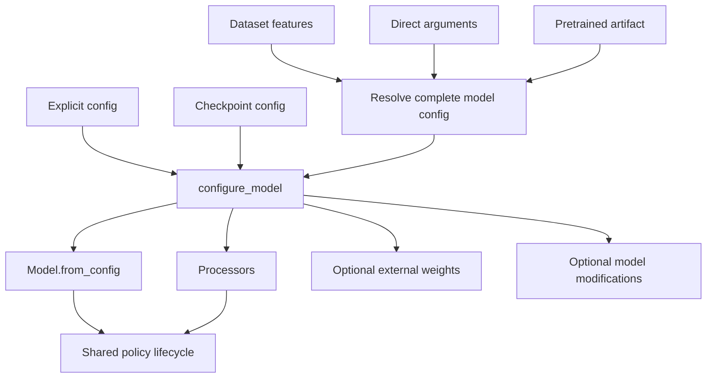

# Policy Architecture

A native policy is the Lightning and environment-facing orchestration layer around a
PyTorch model. It connects configuration, model construction, processing, training,
checkpointing, and optional capabilities without absorbing the implementation of
those concerns.

The central construction rule is:

> Every route that creates a model resolves a complete model config and passes it
> through one policy-owned materialization method.

## Design Goals

A concrete policy should be lean enough to audit by inspection. A reader should be
able to skim its constructor, config resolution, `configure_model()`, and optimizer
setup and understand:

- which construction routes it supports;
- where its feature contract comes from;
- when the model and processors are created;
- when external weights are loaded;
- which optional capabilities are applied afterward.

The policy declares policy-specific choices and connects the owning abstractions. It
does not repeat shared Lightning steps, action-queue behavior, tensor computation,
processing, artifact parsing, or capability logic.

## Structure

A policy normally separates configuration, model computation, processing, and
Lightning integration:

```text
policy_name/
|-- config.py        # Serializable model configuration
|-- model.py         # PyTorch model and loss computation
|-- policy.py        # Construction routes and policy-specific orchestration
|-- preprocessor.py  # Observation conversion and normalization
`-- postprocessor.py # Action conversion and denormalization
```

Small policies may combine files. Ownership boundaries matter more than file layout.



## Ownership

| Owner | Responsibilities |
| --- | --- |
| Model config | Ordered features, architecture, chunk size, action horizon, and serializable model behavior |
| Policy | Construction routes, model and processor lifecycle, optimizer settings, artifact selection, and external weight loading |
| Base policy | Shared Lightning steps, checkpoint hooks, device transfer, validation/rollout flow, and action queues |
| Dataset | Observed feature contract and optional normalization statistics used for training |
| Model | Flat network construction, loss computation, temporal indices, and full action-chunk prediction |
| Processors | Conversion, normalization, denormalization, and external action-contract adaptation |
| Pretrained resolver | Artifact lookup and translation into a model config plus weight paths |
| Capability mixins | Reusable cross-cutting config, policy lifecycle, and model behavior |
| Export mixin | Export schemas, sample generation, backend parameters, tracing, and manifest creation |

Optimizer settings, artifact locations, and export destinations are not model
configuration. Feature-dependent architecture and output interpretation must not be
inferred from normalization statistics.

## Model Configuration

The policy owns one serializable config that completely describes model construction.
Features are ordered because order affects model inputs, action concatenation,
processing, and exported manifests.

The model does not store the config. Its constructor accepts only the flat,
plain-typed values it needs. `Model.from_config(config)` filters policy-only fields
before invoking that constructor. This keeps the model independently understandable
and constructible while allowing the policy to persist the complete contract.

Feature identity and normalization have separate roles:

- the feature contract contains names, types, shapes, and order;
- dataset or processor state contains means, standard deviations, quantiles, and
  other normalization values.

A dataset validates its observed features against the configured contract; it does
not define architecture by way of `dataset_stats`.

## One Materialization Path

`configure_model()` is the only method that creates model-dependent objects. It is
idempotent because Lightning may call it for multiple stages and a constructor may
materialize eagerly for standalone use.

```text
resolve complete config
    -> configure_model
    -> construct flat model
    -> construct processors
    -> load optional external base weights
    -> apply optional reconstruction capabilities
```

The initialized-model guard prevents repeated calls from replacing loaded weights or
applying modifications twice. Construction order is deliberate:

1. Persist the resolved config on the policy.
2. Construct the model from the config.
3. Construct processors from the same ordered feature contract.
4. Load compatible external base weights.
5. Apply state-dict-shaping capabilities before checkpoint tensors are restored.
6. Synchronize runtime capabilities after the model exists.

See [Advanced Patterns](advanced.md) for checkpoint, PEFT, RTC, and gradient
checkpointing details.

## Construction Routes

Several inputs may feed the same materialization path:

| Route | Config source | Weight source |
| --- | --- | --- |
| Explicit config | Caller-provided model config | None |
| Constructor | Explicit features and model defaults | None |
| Lazy training | Existing config validated against training dataset features | None |
| Pretrained | Artifact config adapted through supported overrides | External artifact |
| Checkpoint | Serialized model config | Lightning state dictionary |

An explicit config or complete constructor input can materialize immediately. Lazy
training waits until dataset setup has validated the feature contract. A pretrained
resolver returns config and weight artifacts separately. Checkpoint restoration
reconstructs from the serialized config and never fetches the original pretrained
artifact.

## Runtime Flow

The shared policy lifecycle owns the common flow:

```text
Observation
    -> preprocessor
    -> model tensors
    -> full predicted action chunk
    -> capability transforms
    -> postprocessor
    -> execution-horizon action queue
    -> environment action
```

`Model.predict_action_chunk()` returns the complete native tensor with shape
`(batch_size, chunk_size, model_action_dim)`. Temporal trimming to `n_action_steps`
and removal of padded action dimensions happen afterward. This preserves the full
prediction horizon for capabilities such as real-time chunking.

## Checkpoint Invariant

A checkpoint stores the complete resolved model config. During restoration the policy
materializes the architecture, including any state-dict-shaping capabilities, before
Lightning loads tensors. The pretrained artifact path is cleared before policy
construction so restoration cannot accidentally download or reload external weights.

Detailed hooks and ordering belong in [Advanced Patterns](advanced.md); they are not
part of the minimal policy implementation.

## Related Pages

- [Required Interfaces](interfaces.md)
- [Implement a Policy](how-to.md)
- [Advanced Patterns](advanced.md)
- [Export API](export.md)
