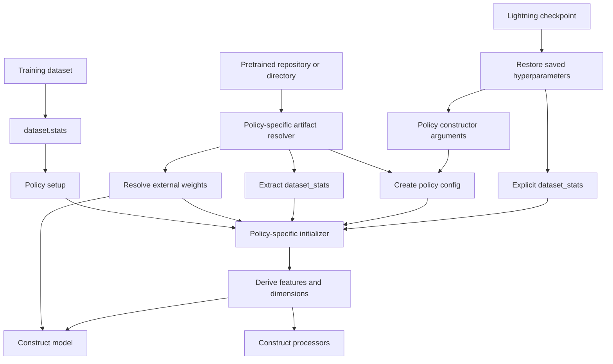
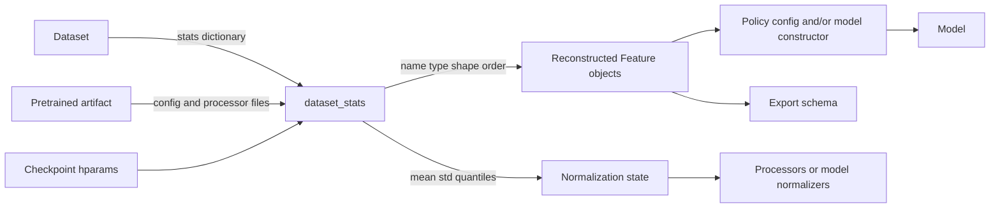
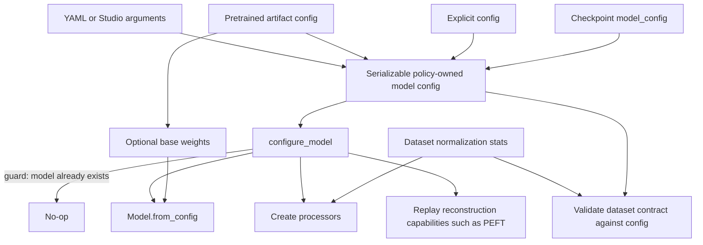
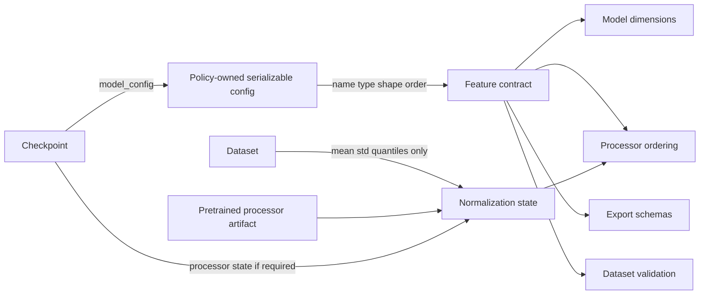
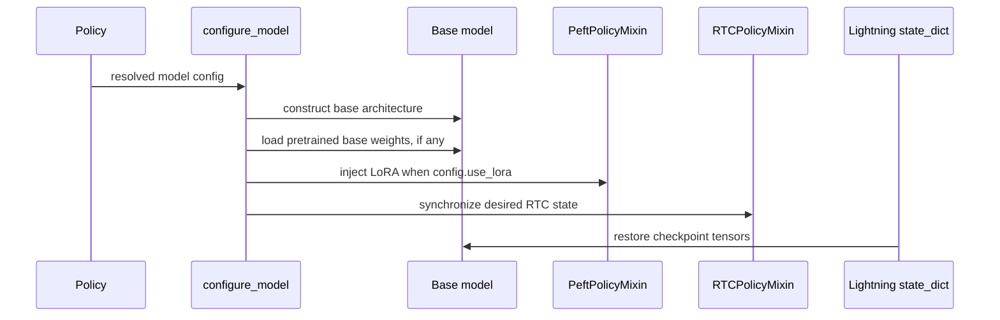
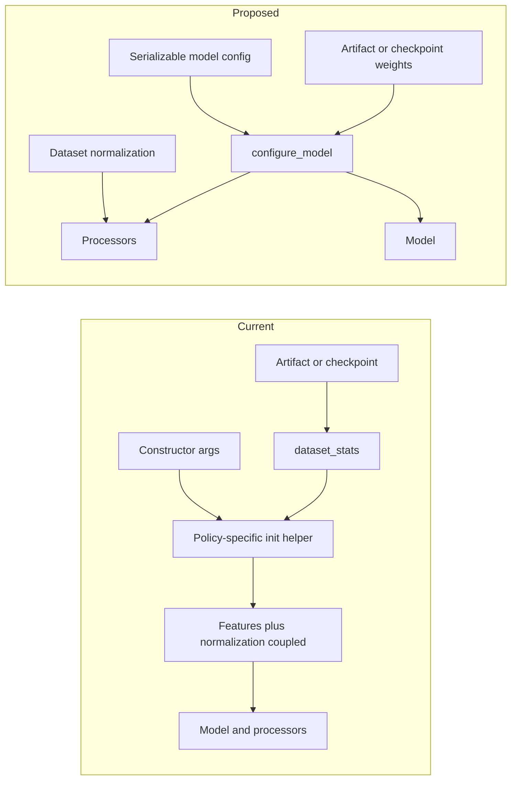

# Current and Proposed Policy Construction

This document compares how first-party policies are constructed today with the
proposed native policy lifecycle. It also traces where feature contracts and
normalization statistics come from for each route.

The comparison separates two concepts:

- **Construction input**: config, pretrained artifact, checkpoint, or dataset.
- **Materialization**: the single operation that creates the model and processors.

The proposal can accept several input sources while still having one guarded model
materialization path: `configure_model()`.

## Summary

| Concern | Current policies | Proposed design |
| --- | --- | --- |
| Model creation | Policy-specific `_initialize_model()` or `_initialize_policy()` calls from constructors, `setup()`, and checkpoint loaders | One idempotent `configure_model()` method |
| Feature source | Frequently reconstructed from `dataset_stats`; sometimes supplied separately or embedded in third-party config | Ordered input/output features are explicit in the policy-owned serializable config |
| Normalization source | `dataset_stats`, sometimes also copied into `Feature` or model state | Dataset/artifact normalization data is supplied to processors, separate from the feature contract |
| Pretrained loading | Each policy resolves config, stats, and weights differently | Resolver produces config, processor state, and weights; policy materializes once |
| Checkpoint reconstruction | Usually relies on saved constructor hyperparameters, including `dataset_stats`; LeRobot has a custom loader | Checkpoint config reconstructs the architecture through `configure_model()` before Lightning loads tensors |
| Duplicate initialization | Guarding differs by policy | `configure_model()` returns when `self.model` already exists |
| Optional capabilities | Policy-specific wiring | Existing PEFT and RTC config/model/policy mixins own their respective lifecycle |

## Current Construction

The current implementations use several related but distinct patterns. ACT, Pi0,
Pi05, SmolVLA, Groot, RLDX1, and LeRobot do not share one construction contract.

### Current Route Overview



The significant point is that `dataset_stats` commonly carries two responsibilities:

1. feature identity, type, shape, and order;
2. normalization values such as mean, standard deviation, and quantiles.

This makes statistics part of architecture discovery rather than processor data only.

### Current Routes

#### 1. Fresh lazy training

This is the common training path for ACT, Pi0, Pi05, SmolVLA, Groot, and RLDX1.

```text
Policy(...model and training arguments...)
    -> constructor creates a partial policy config
    -> model remains None
Trainer.fit(policy, datamodule)
    -> setup(stage)
    -> read train_dataset.stats
    -> infer features and dimensions from dataset_stats
    -> _initialize_model(...) or equivalent
    -> construct model and processors
```

The exact helper varies:

| Family | Current materialization helper |
| --- | --- |
| ACT | `_initialize_model(dataset_stats, weights_file)` |
| Groot | `_initialize_model(env_action_dim, dataset_stats)` |
| Pi0 | `_initialize_model(dataset_stats)` |
| Pi05 | `_initialize_model(dataset_stats, weight_file)` |
| SmolVLA | `_initialize_model(dataset_stats, weights_file)` |
| RLDX1 | `_initialize_model(dataset_stats, shard_files)` |
| LeRobot | `_initialize_policy(input_features, output_features, config, dataset_stats)` |

#### 2. Eager construction

Several policies initialize in `__init__()` when enough dataset-derived information is
provided:

```text
Policy(dataset_stats=..., optional dimensions/config...)
    -> constructor creates or resolves config
    -> constructor calls policy-specific initializer
    -> model and processors exist before Trainer attachment
```

Examples include ACT, Pi0, Pi05, SmolVLA, and RLDX1 when `dataset_stats` is supplied.
Groot requires `env_action_dim` and may also consume `dataset_stats`. LeRobot can build
eagerly from input/output features or an underlying LeRobot config.

#### 3. Pretrained construction

```text
Policy(pretrained_name_or_path=...)
    -> _from_hf(...) or equivalent
    -> read artifact config
    -> extract or download processor statistics
    -> resolve model weight files
    -> policy-specific initializer
    -> construct model
    -> load external weights
    -> construct/update processors
```

The returned bundle differs by family. For example, Pi05 and SmolVLA return a policy
config, `dataset_stats`, and a weight path; RLDX1 additionally resolves shards and
camera names. This makes each pretrained route responsible for recreating both the
feature contract and normalization state.

#### 4. Lightning checkpoint restoration

Most current native policies save constructor hyperparameters and `dataset_stats` so
Lightning can invoke `__init__()` again:

```text
Policy.load_from_checkpoint(path)
    -> Lightning reads hyperparameters
    -> Lightning calls Policy(...saved hparams..., dataset_stats=...)
    -> constructor eagerly creates model
    -> Lightning loads state_dict
```

LeRobot is an exception. Its custom `load_from_checkpoint()` reads the checkpoint,
finds the concrete policy name and config, reconstructs the wrapper, and then restores
weights.

#### 5. Explicit config and feature construction

Support is inconsistent. Some policy/config classes expose `from_config()`, while
others primarily expose large policy constructors. LeRobot accepts explicit input and
output feature dictionaries. RLDX1 accepts explicit feature overrides but merges them
into `dataset_stats`. There is no common Studio/backend route shared by every policy.

## Current Feature Ownership



### Current locations by family

| Family | Feature contract today | Normalization today |
| --- | --- | --- |
| ACT | Reconstructed from `dataset_stats`; passed into `ACTModel` | `dataset_stats` becomes feature normalization and model normalizer state |
| Groot | Action dimension and processing inferred from dataset metadata/stats | Processor state from `dataset_stats` |
| Pi0 | Action shape and processing inferred from `dataset_stats` | Processor state from `dataset_stats` |
| Pi05 | Config plus dimensions/features inferred from `dataset_stats` | Processor state and export metadata from `dataset_stats` |
| SmolVLA | Config plus dimensions/features inferred from `dataset_stats` | Processor state and export metadata from `dataset_stats` |
| RLDX1 | Explicit features are merged into `dataset_stats`; view count is inferred from it | Processor state from the merged stats dictionary |
| LeRobot | Explicit/underlying LeRobot feature dictionaries | Separate `dataset_stats`, but passed alongside features into processor construction |

Consequences of the current arrangement:

- feature identity can depend on whether construction came from a dataset, artifact,
  checkpoint, or explicit arguments;
- export code may inspect `dataset_stats` to rediscover names and shapes;
- changing normalization data can appear to change the model contract;
- checkpoint reconstruction often needs statistics before the model can exist.

## Proposed Construction

The proposal makes the policy-owned config the explicit source of model structure and
uses Lightning's `configure_model()` as the only model materialization method.



`configure_model()` is idempotent:

```python
def configure_model(self) -> None:
    if self.model is not None:
        return

    config = self._config or self._resolve_config()
    self._config = config
    self.model = MyModel.from_config(config)
    self._preprocessor, self._postprocessor = make_policy_processors(config)
    ...
```

The guard prevents constructor, Trainer, checkpoint, or export paths from rebuilding a
model that already contains loaded base weights or injected adapters.

### Proposed routes

#### 1. Studio/YAML or direct constructor

```text
Explicit features and model arguments
    -> resolve serializable config
    -> configure_model()
    -> construct once
```

If complete features or a pretrained path are supplied, the constructor may call the
idempotent hook immediately. Lightning may call it later without rebuilding.

#### 2. Explicit config

```text
Policy.from_config(config)
    -> policy owns config
    -> configure_model()
    -> construct once
```

This is the preferred single route for Studio/backend integrations because the same
serializable object describes the model controls exposed in the UI.

#### 3. Pretrained artifact

```text
Artifact identifier
    -> resolve model config
    -> resolve processor normalization state separately
    -> configure_model()
    -> construct base model
    -> load base weights
    -> replay reconstruction capabilities such as LoRA
```

The artifact location is not persisted as a checkpoint reconstruction dependency.

#### 4. Lightning checkpoint

```text
Policy.load_from_checkpoint(path)
    -> force pretrained_name_or_path=None
    -> deserialize checkpoint model_config
    -> configure_model()
    -> reconstruct model and required capabilities
    -> Lightning loads state_dict
    -> restore runtime capability state
```

This route never downloads original pretrained weights.

#### 5. Training dataset

The target design does not derive the feature contract from normalization statistics.
A dataset supplies normalization values to processors and validates that its actual
features match the policy config.

```text
Policy model config -----------------------> feature contract
Training dataset --> normalization stats --> processors
Training dataset --> observed features ----> contract validation
```

The current executable template still permits lazy feature adoption from the dataset
and stores normalization on `Feature`. Those are migration accommodations, not the
final decoupled target.

## Proposed Feature Ownership



### Source of truth by route

| Route | Feature source | Normalization source | Model weights |
| --- | --- | --- | --- |
| Studio/YAML | Serialized model config | Dataset or explicit processor artifact | Fresh or selected artifact |
| Explicit config | Caller-provided model config | Dataset or explicit processor state | Fresh |
| Pretrained | Artifact model config, with explicit supported overrides | Pretrained processor artifact or training dataset | Pretrained artifact |
| Checkpoint | Checkpoint `model_config` | Checkpoint processor state or attached dataset | Checkpoint `state_dict` |
| Training | Existing model config; dataset validates it | Training dataset | Fresh or previously loaded |

The feature contract contains names, types, shapes, and order. Normalization contains
statistics only. No route reconstructs the feature contract by parsing
`dataset_stats`.

## Mixins During Construction

The proposal uses the existing PEFT and RTC mixin families rather than local policy
flags.



- **PEFT/LoRA** changes state-dict structure. `PeftConfigMixin` is mixed into the
  checkpointed config, `PeftModelMixin` supplies architecture-specific default target
  modules, and `PeftPolicyMixin` injects adapters after base weights but before
  Lightning restores checkpoint tensors.
- **RTC** is runtime state. `RTCPolicyMixin` owns and checkpoints the enabled flag;
  `RTCModelMixin` implements model-side behavior. Synchronization occurs after model
  construction. RTC receives the model's full action chunk before policy-level
  trimming.

## Before and After



The intended improvement is not merely fewer helper names. It is that every route
answers the same questions in the same place:

1. Which serialized config defines the model and feature contract?
2. Which separate data defines normalization?
3. Has the model already been materialized?
4. Which capabilities must be replayed before state-dict loading?
5. Which runtime capabilities can be restored afterward?

## Migration Notes

1. Add explicit ordered input/output features to each policy-owned serializable config.
2. Stop reconstructing feature contracts from `dataset_stats`.
3. Keep normalization statistics in dataset or processor state.
4. Replace policy-specific model creation calls with an idempotent `configure_model()`.
5. Save the reconstruction config independently from training recipe and artifact paths.
6. Reconstruct state-dict-shaping capabilities such as PEFT before loading tensors.
7. Restore runtime capabilities such as RTC through their cooperative checkpoint hooks.
8. Derive export schemas from the policy-owned feature contract.
