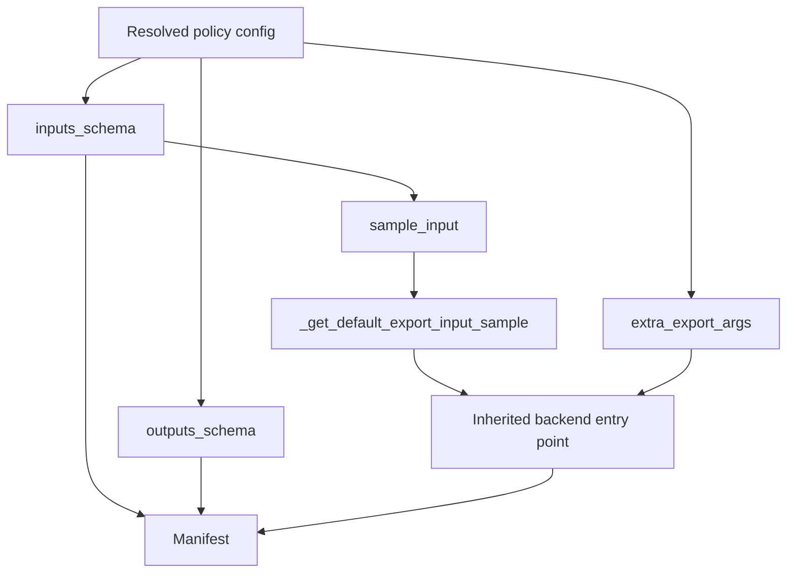

# Export API

Export is an optional policy capability. `ExportablePolicyMixin` owns backend entry
points, tracing, conversion, and manifest creation. A policy that needs custom export
metadata supplies it through a dedicated policy export mixin, keeping the core policy
focused on construction and training.

The export hooks remain properties. They are computed interfaces, not passive fields:
property access may derive metadata, validate the resolved config, and raise a targeted
error. Call sites such as `policy.inputs_schema` also make clear that these values
belong to the current policy state.

## Lifecycle



The schemas describe export tracing and manifest wiring. They are not training-time
model inputs and do not participate in model construction.

## Public Properties

### `inputs_schema`

Describes raw runtime inputs in manifest order as `InferenceFeature` objects. Derive it
from the resolved policy config rather than `dataset_stats` or a separate feature
registry.

Return `None` when the policy config is not available or export is unsupported. Once a
policy is configured for export, raise a specific error for invalid or ambiguous
features, such as multiple state features where the backend contract allows one.

### `outputs_schema`

Describes exported outputs in manifest order. An action output normally includes the
model's full `chunk_size` in its shape; an export postprocessor may trim it to
`n_action_steps` for the deployed runtime contract.

Apply the same availability rule: `None` means the schema cannot yet be provided;
configured-but-invalid output metadata raises a targeted error.

### `sample_input`

Provides raw representative values used when an export backend needs tracing and the
caller did not supply `input_sample` explicitly. The default implementation can derive
samples from `inputs_schema`, including tensor shape and dtype.

A policy export mixin overrides this property when schema-derived values are
insufficient, for example when realistic token IDs, masks, or RTC control inputs are
required. Returning `None` means the caller must provide a sample.

### `extra_export_args`

Returns backend-keyed `ExportParameters`. Use it for stable policy requirements such
as output names, dynamic axes, tokenizer behavior, preprocessing and postprocessing
manifest components, or compression defaults.

These values are computed from resolved config and export state. One-off destination
or conversion choices remain arguments to the export call.

### `get_supported_export_backends()`

Declares which inherited backend entry points the policy supports. Do not advertise a
backend merely because the base mixin implements its method; the policy's model and
processing contract must be valid for that backend.

## Backend Entry Points

### `to_onnx()`

Exports the model through ONNX using an explicit `input_sample` or the default sample
pipeline. It combines call-specific keyword arguments with ONNX parameters from
`extra_export_args` and writes manifest metadata from the schemas.

Concrete policies inherit this method. Express ordinary customization through the
public properties rather than overriding the backend flow.

### `to_openvino()`

Exports or converts the model to OpenVINO, again using the sample pipeline, backend
parameters, and schemas. Concrete policies inherit it under the same rule.

### Other backends

`to_torch()` and `to_executorch()` follow the same ownership model. Supported backends
are declared explicitly by `get_supported_export_backends()`.

## Default Sample Pipeline

`_get_default_export_input_sample()` is internal plumbing:

1. access `sample_input`;
2. move tensor values to the policy device;
3. run the policy preprocessor;
4. retain tensors accepted by model tracing.

It is documented here so failures can be located in the lifecycle, but it is not a
routine public override. If a policy cannot express its tracing contract through
`inputs_schema` and `sample_input`, put a narrow override in a dedicated export mixin
and add focused backend tests. See [Advanced Patterns](advanced.md#exceptional-export-customization).

## Example Export Mixin

```python
class MyPolicyExportMixin(ExportablePolicyMixin):
    @property
    def inputs_schema(self) -> list[InferenceFeature] | None:
        if self._config is None:
            return None
        return build_input_schema(self._config)

    @property
    def outputs_schema(self) -> list[InferenceFeature] | None:
        if self._config is None:
            return None
        return build_output_schema(self._config)

    @property
    def extra_export_args(self) -> dict[str, ExportParameters]:
        if self._config is None:
            return {}
        return build_backend_parameters(self._config, self.outputs_schema)

    @staticmethod
    def get_supported_export_backends() -> list[str | ExportBackend]:
        return [ExportBackend.TORCH, ExportBackend.ONNX, ExportBackend.OPENVINO]
```

The builders above may be private functions in the export module when they make
validation easier to test. They should not leak into the core policy implementation.

## Failure Semantics

Use failures consistently:

| State | Result |
| --- | --- |
| Config not resolved yet | Schema/sample property may return `None` |
| Export capability intentionally unsupported | Schema/sample property returns `None`; backend is not advertised |
| Resolved config violates export contract | Raise `ValueError` with the invalid feature and expected contract |
| Tracing requires a sample but none exists | Backend entry point raises `RuntimeError` explaining how to provide one |
| Backend-specific parameter is invalid | Raise at property evaluation or backend validation with backend context |

Properties can fail like methods. Clear property names, focused validation messages,
and this explicit lifecycle make those failures debuggable without changing the API
to method calls.

## What Not to Override

In a concrete policy class, do not override:

- `to_onnx()` or `to_openvino()` for routine parameter changes;
- manifest creation merely to rename inputs or outputs;
- `_get_default_export_input_sample()` when `sample_input` can represent the raw
  contract;
- export hooks to influence training-time feature or model construction.

If backend flow truly differs, isolate it in the dedicated export mixin and document
why the public properties are insufficient.

## Related Pages

- [Export system overview](../export/README.md)
- [Export API migration](export-api-migration.md)
- [Advanced Patterns](advanced.md)
